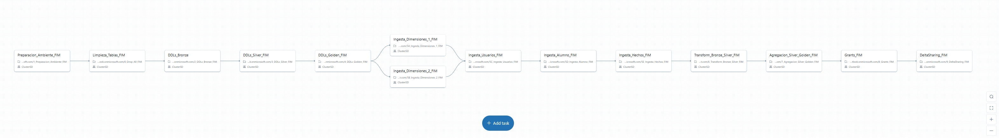

<div align="center">

# 🎓 ETL Pipeline for FIM Postgraduate Student Payments System
### Arquitectura Medallion en Azure Databricks


*Pipeline ETL para el procesamiento y análisis de pagos de estudiantes del Posgrado FIM-UNI con arquitectura Medallion y despliegue continuo*

</div>

---

## 🎯 Descripción

Pipeline ETL de nivel empresarial para el procesamiento de transacciones financieras académicas del Posgrado de la Facultad de Ingeniería Mecánica de la Universidad Nacional de Ingeniería (FIM-UNI). Implementa la Arquitectura Medallion (Bronze-Silver-Gold) en Azure Databricks con CI/CD automatizado y Delta Lake para garantizar consistencia ACID y trazabilidad completa.

### ✨ Características Principales

- 🔄 **ETL Automatizado** - Pipeline completo con despliegue automático via GitHub Actions
- 🏗️ **Arquitectura Medallion** - Separación clara de capas Bronze → Silver → Gold
- 📊 **Modelo Dimensional** - Star Schema optimizado para análisis de negocio
- 🚀 **CI/CD Integrado** - Deploy automático en cada push a master
- 📈 **Databricks Dashboards** - Visualización
- ⚡ **Delta Lake** - ACID transactions y time travel capabilities
- 🔔 **Monitoreo** - Notificaciones automáticas y logs detallados

---

## 🏛️ Arquitectura

### Flujo de Datos

```
📁 Datos Fuente (Sistemas FIM-UNI)
    ↓
🔧 1_Preparacion_Ambiente_FIM
    ↓
🗑️ 0_Drop_All_FIM (Limpieza inicial)
    ↓
🥉 2_DDLs_Bronze_FIM (Esquemas Bronze)
    ↓
🥈 3_DDLs_Silver_FIM (Esquemas Silver)
    ↓
🥇 4_DDLs_Golden_FIM (Esquemas Gold)
    ↓
    ┌─────────────────────────────────────┐
📊 5A_Ingesta_Dimensiones_1_FIM    📊 5B_Ingesta_Dimensiones_2_FIM
    │                                    │
    └───────────┬────────────────────────┘
                ↓
👥 5C_Ingesta_Usuarios_FIM
                ↓
🎓 5D_Ingesta_Alumno_FIM
                ↓
💰 5E_Ingesta_Hechos_FIM (Transacciones de pagos)
                ↓
🔄 6_Transform_Bronze_Silver_FIM (ETL principal)
                ↓
📈 7_Agregacion_Silver_Golden_FIM (KPI's académicos)
                ↓
🔐 8_Grants_FIM (Gestión de permisos)
                ↓
🤝 9_DeltaSharing_FIM (Compartir datos)
    ↓
📊 Power BI Dashboards (Visualización ejecutiva)
```


### 📦 Capas del Pipeline

<table>
<tr>
<td width="33%" valign="top">

#### 🥉 Bronze Layer
**Propósito**: Zona de aterrizaje para datos crudos del sistema académico

**Tablas Principales**: 
- `alumnos_bronze - Datos básicos de estudiantes` 
- `maestrias_bronze - Programas de posgrado y especialidades` 
- `conceptos_pago_bronze - Tipos de pagos académicos`
- `reportes_economicos_bronze - Transacciones financieras` 
- `periodos_bronze - Periodos académicos`

**Características**:
- ✅ Datos extraídos directamente de pfimapp_*.csv
- ✅ Timestamp automático de ingesta
- ✅ Preservación histórica completa
- ✅ Sin validaciones ni transformaciones
- ✅ Estructura idéntica a los archivos origen

</td>
<td width="33%" valign="top">

#### 🥈 Silver Layer
**Propósito**: Modelo dimensional para análisis académico-financiero

**Tablas Principales**:
- `dim_alumno - Información completa de estudiantes`
- `dim_maestria - Programas y especialidades con atributos`
- `dim_periodo - Dimensión temporal académica`
- `dim_concepto_pago - Catálogo de conceptos de pago`
- `fact_pagos - Hechos de transacciones financieras`
- `fact_estado_academico - Situación académica por alumno`

**Características**:
- ✅ Star Schema optimizado para consultas
- ✅ Validación completa de datos académicos
- ✅ Limpieza de duplicados e inconsistencias
- ✅ Normalización de formatos y estándares
- ✅ Relaciones académicas bien definidas

</td>
<td width="33%" valign="top">

#### 🥇 Gold Layer
**Propósito**: Vistas analíticas listas para toma de decisiones

**Tablas/Vistas Analíticas**:
- kpi_pagos_por_maestria - Ingresos totales agrupados por programa y periodo
- kpi_estado_financiero_alumnos - Situación de pagos por estudiante
- kpi_morosidad_academica - Análisis de deudas por cohorte
- kpi_distribucion_conceptos - Conceptos de pago más frecuentes
- kpi_proyeccion_ingresos - Forecast financiero por trimestre

**Características**:
- ✅ Agregaciones pre-calculadas para BI
- ✅ Optimizado para Power BI con DirectQuery
- ✅ Actualizaciones incrementales automáticas
- ✅ KPI's académicos pre-definidos
- ✅ Máximo performance para dashboards ejecutivos

</td>
</tr>
</table>

---

## 📁 Estructura del Proyecto

```
ETL_PosgradoFIM/
│
├── 📂 .github/workflows/
│   └── 📄 deploy-notebook.yml          # Pipeline CI/CD para Databricks
│
├── 📂 Certificaciones/                 # Certificaciones obtenidas
│   ├── 📄 Databricks Fundamentals.pdf
│   ├── 📄 Databricks Generative AI Fundamentals.pdf
│   ├── 📄 Databricks Platform Administrator.pdf
│   ├── 📊 Dashboard.pdf                # Export del dashboard
│   └── 🖼️ Dashboard.png               # Imagen del dashboard
│
├── 📂 Procesos/                        # Notebooks de procesamiento ETL
│   ├── 🎓 5A_Ingesta_Dimensiones_1_FIM.py      # Ingestion dimensiones 1
│   ├── 🎓 5B_Ingesta_Dimensiones_2_FIM.py      # Ingestion dimensiones 2
│   ├── 👥 5C_Ingesta_Usuarios_FIM.py          # Ingestion usuarios
│   ├── 🎓 5D_Ingesta_Alumno_FIM.py            # Ingestion alumnos
│   ├── 💰 5E_Ingesta_Hechos_FIM.py            # Ingestion transacciones
│   ├── 🔄 6_Transform_Bronze_Silver_FIM.py    # Transformación Bronze→Silver
│   └── 📈 7_Agregacion_Silver_Golden_FIM.py   # Agregación Silver→Gold
│
├── 📂 Reversion/                       # Scripts de reversión/limpieza
│   └── 🧹 0_Drop_All_FIM.py            # Limpieza completa de datos
│
├── 📂 Scripts/                         # Scripts de preparación y DDLs
│   ├── ⚙️ 1_Preparacion_Ambiente_FIM.py      # Preparación del ambiente
│   ├── 🥉 2_DDLs_Bronze_FIM.py               # DDLs para capa Bronze
│   ├── 🥈 3_DDLs_Silver_FIM.py               # DDLs para capa Silver
│   └── 🥇 4_DDLs_Golden_FIM.py               # DDLs para capa Gold
│
├── 📂 Seguridad/                       # Gestión de seguridad y permisos
│   ├── 🔐 8_Grants_FIM.py              # Asignación de permisos
│   └── 📄 README.md                    # Documentación de seguridad
│
└── 📄 README.md                        # Documentación principal del proyecto
```

---

## 🛠️ Tecnologías

<div align="center">

| Tecnología | Propósito |
|:----------:|:----------|
|  | Motor de procesamiento distribuido Spark |
|  | Storage layer con ACID transactions |
|  | Framework de transformación de datos |
|  | Data Lake para almacenamiento persistente |
|  | Automatización CI/CD |
|  |  Visualización |

</div>

---

## ⚙️ Requisitos Previos

1. Archivos Fuente del Sistema FIMAPP
Acceso a los 12 archivos CSV del sistema académico:

- ✅ pfimapp_alumno.csv - Datos de estudiantes

- ✅ pfimapp_user.csv - Usuarios del sistema

- ✅ pfimapp_maestria.csv - Programas de posgrado

- ✅ pfimapp_conceptopago.csv - Conceptos de pago

- ✅ pfimapp_reporteeconomico.csv - Reportes económicos

- ✅ pfimapp_reporteecoconceptopago.csv - Detalles de pagos

- ✅ pfimapp_periodo.csv - Periodos académicos

- ✅ pfimapp_sede.csv - Sedes de estudio

- ✅ pfimapp_estadoacademico.csv - Estado académico

- ✅ pfimapp_estadoboletap.csv - Estado de boletas

- ✅ pfimapp_estadocivil.csv - Estado civil

- ✅ pfimapp_tipodocumento.csv - Tipos de documento

2. Infraestructura Azure
- ☁️ Cuenta de Azure con suscripción activa

- 🏢 Azure Databricks Workspace configurado

- 💾 Azure Data Lake Storage Gen2:

Storage Account: adlsnolascodev2411

Contenedores: fim-bronze, fim-silver, fim-gold

- 🔐 Service Principal con permisos de Contributor en ADLS

3. Configuración Databricks
- 🖥️ Cluster activo: ClusterSD (Standard_D4s_v3, Single Node)

- 📁 Unity Catalog: catalog_fim configurado

- 📂 Esquemas: bronze, silver, gold creados

- 🔑 Access Tokens: Generados para API de Databricks

- ⚙️ Workspace paths: /proyecto_posgrado/ configurado

4. Integración CI/CD con GitHub
- 🐙 Cuenta de GitHub con repositorio del proyecto

- ⚡ GitHub Actions habilitado en el repositorio

- 🔐 Secrets configurados en GitHub Settings:

DATABRICKS_ORIGIN_HOST

DATABRICKS_ORIGIN_TOKEN

DATABRICKS_DEST_HOST

DATABRICKS_DEST_TOKEN

- 👨‍💼 Permisos de administrador en el repositorio

5. Herramientas de Desarrollo
- 💻 Python 3.8+ instalado localmente

- 🔧 Databricks CLI configurado y autenticado

- 📦 Librerías esenciales:

databricks-cli>=0.17.0

requests>=2.28.0

jq (para procesamiento JSON en CI/CD)

- 🖥️ Terminal bash (Git Bash en Windows, Terminal en Mac/Linux)

6. Visualización con Power BI (Recomendado)
- 📊 Power BI Desktop (versión actual)

- 🔗 Conector Databricks instalado

- 🔄 DirectQuery configurado para conexión en vivo

- 📈 Licencia Power BI Pro/PPU para publicación de dashboards

- 🎨 Workspace Power BI para compartir reportes

7. Permisos y Seguridad
- 👨‍💼 Rol Admin en Databricks Workspace

- 📋 Storage Blob Data Contributor en ADLS Gen2

- 🔄 Acceso a APIs: jobs/run, workspace/import, clusters/list

- 📧 Email configurado para notificaciones de workflow

- 🔐 Secret Scope configurado en Databricks para credenciales

---

## 🚀 Instalación y Configuración

### 1️⃣ Clonar el Repositorio

```bash
https://github.com/jolurn/cicdPosgradoFIM.git
cd project-databricks
```

### 2️⃣ Configurar Databricks Token

1. Ir a Databricks Workspace
2. **User Settings** → **Developer** → **Access Tokens**
3. Click en **Generate New Token**
4. Configurar:
   - **Comment**: `GitHub CI/CD`
   - **Lifetime**: `90 days`
5. ⚠️ Copiar y guardar el token

### 3️⃣ Configurar GitHub Secrets

En tu repositorio: **Settings** → **Secrets and variables** → **Actions**

| Secret Name | Valor Ejemplo |
|------------|---------------|
| `DATABRICKS_HOST` | `https://adb-xxxxx.azuredatabricks.net` |
| `DATABRICKS_TOKEN` | `dapi_xxxxxxxxxxxxxxxx` |

### 4️⃣ Verificar Storage Configuration

```python
storage_path = "abfss://raw@adlsnolascodev2411.dfs.core.windows.net"
```

<div align="center">

✅ **¡Configuración completa!**

</div>

---

## 💻 Uso

### 🔄 Despliegue Automático (Recomendado)

```bash
git add .
git commit -m "✨ feat: mejoras en pipeline"
git push origin master
```

**GitHub Actions ejecutará**:
- 📤 Deploy de 14 notebooks a `/proyecto_posgrado/`
- 🔧 Creación del workflow `WF_ETL_PFIM`
- ▶️ Ejecución completa:  Bronze → Silver → Gold
- 📧 Notificaciones de resultados

### 🖱️ Despliegue Manual desde GitHub

1. Ir al tab **Actions** en GitHub
2. Seleccionar **Dynamic Databricks Notebook Deploy**
3. Click en **Run workflow**
4. Seleccionar rama `main`
5. Click en **Run workflow**

### 🔧 Ejecución Local en Databricks

Navegar a `proyecto_posgrado` y ejecutar en orden:

```
🎯 FASE 1: PREPARACIÓN
- 1_Preparacion_Ambiente_FIM.py    → Configuración inicial del entorno
- 0_Drop_All_FIM.py                → Limpieza de datos anteriores

🏗️ FASE 2: CREACIÓN DE ESQUEMAS  
- 2_DDLs_Bronze_FIM.py             → Esquemas para datos crudos (Bronze)
- 3_DDLs_Silver_FIM.py             → Esquemas para datos limpios (Silver)
- 4_DDLs_Golden_FIM.py             → Esquemas para vistas analíticas (Gold)

📥 FASE 3: INGESTA DE DATOS ACADÉMICOS
- 5A_Ingesta_Dimensiones_1_FIM.py  → Dimensiones básicas del sistema
- 5B_Ingesta_Dimensiones_2_FIM.py  → Dimensiones adicionales académicas
- 5C_Ingesta_Usuarios_FIM.py       → Datos de usuarios del sistema FIMAPP
- 5D_Ingesta_Alumno_FIM.py         → Información completa de estudiantes
- 5E_Ingesta_Hechos_FIM.py         → Transacciones financieras y pagos

🔄 FASE 4: TRANSFORMACIÓN Y ANÁLISIS
- 6_Transform_Bronze_Silver_FIM.py → ETL principal: Bronze → Silver
- 7_Agregacion_Silver_Golden_FIM.py → Generación de KPI's: Silver → Gold

🔐 FASE 5: GESTIÓN Y SEGURIDAD
- 8_Grants_FIM.py                  → Asignación de permisos de acceso
- 9_DeltaSharing_FIM.py            → Compartir datos con Power BI
```

---


## 🔄 CI/CD

### Pipeline de GitHub Actions

```yaml
Workflow: Dynamic Databricks Notebook Deploy
├── Trigger: Push a rama main
├── Paso 1: Exportar 14 notebooks desde workspace origen
├── Paso 2: Desplegar notebooks a /proyecto_posgrado/
├── Paso 3: Eliminar workflow WF_ADB anterior (si existe)
├── Paso 4: Buscar cluster ClusterSD configurado
├── Paso 5: Crear nuevo workflow WF_POSGRADO con 14 tareas
├── Paso 6: Validar configuración del workflow creado
├── Paso 7: Ejecutar pipeline ETL completo automáticamente
├── Paso 8: Monitorear ejecución en tiempo real (10 min timeout)
└── Paso 9: Limpiar archivos temporales y notificar resultados
```

### 🔄  Workflow Databricks



---

## 📈 Dashboards


## 🔍 Monitoreo

### En Databricks

**Workflows**:
- Ir a **Workflows** en el menú lateral
- Buscar `WF_ETL_PFIM`
- Ver historial de ejecuciones

**Logs por Tarea**:
- Click en una ejecución específica
- Click en cada tarea para ver logs detallados
- Revisar stdout/stderr en caso de errores

### En GitHub Actions

- Tab **Actions** del repositorio
- Ver historial de workflows
- Click en ejecución específica para detalles
- Revisar logs de cada step

---

## 👤 Autor

<div align="center">

### Jorge Luis Ramos Nolasco

[](https://www.linkedin.com/in/jramosn/)
[]([https://github.com/guaru](https://github.com/jolurn))
[](jolurn7@gmail.com)

**Data Engineering** | **Azure Databricks** | **Delta Lake** | **CI/CD**

</div>

---

## 📄 Licencia

Este proyecto está bajo la Licencia MIT - ver el archivo [LICENSE](LICENSE) para más detalles.

---

<div align="center">

**Proyecto**: Data Engineering - Arquitectura Medallion  
**Tecnología**: Azure Databricks + Delta Lake + CI/CD  
**Última actualización**: 2025


</div>
